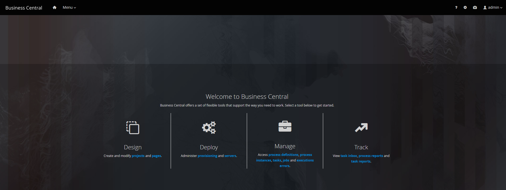
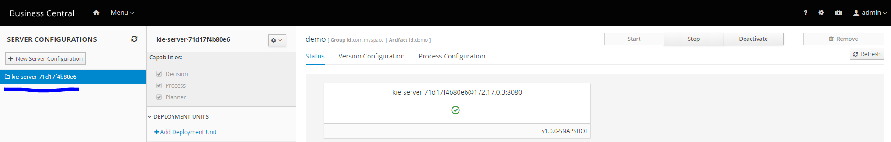

Hi,

In this short tutorial we will setup **JBoss Drools Workbench** (**_7.17.0.Final_**) and **KIE server** (**_7.17.0.Final_**) on **Wildfly** (**_14.0.1.Final_**) on **Ubunbtu** (**_18.04_**) using **Docker CE**.

## Step 1

Login into AWS Console and from EC2 Dashboard, launch an AWS EC2 instance **(64-bit x86)** that has **Ubuntu 18.04** installed on it. The AMI image to use is **_ami-0c55b159cbfafe1f0_**.

For this tutorial we can work with a **t2.medium** instance type.

{: style="text-align: center;display: block"}


## Step 2

Configure a security group for our EC2 instance as shown below. 


We have allowed an inbound traffic from everywhere on TCP ports **22**, **8080** and **8081**. This is done so that we can access **SSH**, **JBoss Drools Workbench** and **KIE server** respectively.

Please continue launching the EC2 instance. On **_Review Instance Launch_** screen, generate a private key pair and keep it somewhere save on your local machine. We will use it later to SSH into our EC2 instance.

Below are the details of the EC2 instance that we are about to launch.


## Step 3

Now wait for the EC2 instance to launch and then SSH into the instance using the public IP assigned and the private key that we saved while launching the instance. Since I am on windows, I will be using **Git Bash** to SSH. Start the SSH Agent using below command:

``` > ssh-agent ```


The command to SSH into our EC2 instance is

``` > ssh –i <private-key-file-name>.pem ubuntu@<public-ip-of-ec2-instance> ```

## Step 4

Once we are in, we need to install Docker CE. For that we can refer to the official Docker documentation for installing Docker on Ubuntu which is at the following URL.

```https://docs.docker.com/install/linux/docker-ce/ubuntu/```

You can skip to **Install Docker CE** section.

To verify our Docker installation, we can run the following command:

``` > sudo docker run hello-world ```


The output will look like as shown below.

{: style="text-align: center;display: block"}

## Step 5

Now we need to install JBoss Drools Workbench and KIE server.

Let’s setup **JBoss Drools Workbench 7.17.0.Final** on **Wildfly 14.0.1.Final** using **Docker**.

In the console, run the below command:

``` > sudo docker run -p 8080:8080 -p 8001:8001 -e JAVA_OPTS="-server -Xms1024m -Xmx1024m -Djava.net.preferIPv4Stack=true -Dfile.encoding=UTF-8" -v /home/ubuntu/wb_git:/opt/jboss/wildfly/bin/.niogit:Z -d --name drools-workbench jboss/drools-workbench-showcase:latest ```

This command will download the JBoss Drools Workbench showcase image from Docker Hub and start a container based on this image. You can learn more about this image and the available configurations at

```https://hub.docker.com/r/jboss/drools-workbench-showcase/```

Note that we are mapping the port **8080** and **8001** on host to port **8080** and **8001** inside the container. 

Inside the container, the Wildfly server on which Drools workbench is deployed is listening on these ports. By exposing these ports on the host we can access the JBoss Drools Workbench publicly.

We are also passing in environment variables to Wildfly instance to set the available memory for JVM on startup i.e. is **1024 MB** _(-Xms1024m -Xmx1024m)_.

We have mounted the host directory **/home/Ubuntu/wb_git** to **/opt/jboss/wildlfy/bin/.niogit**. By default, the internal Git root directory for JBoss Drools Workbench container is located at **/opt/jboss/wildfly/bin/.niogit**. This will be removed along with all of our project data once we stop and remove the container. 

To make this directory persistent across container terminations or even EC2 instance restarts, we are mounting the host directory **/home/ubuntu/wb_git** to **/opt/jboss/wildlfy/bin/.niogit** so that when the container is removed or the EC2 instance is restarted, our project data is still safe and we can simply create a new container and continue with our work.

Create the required directory (**/wb_git**) with below command under **/home/ubuntu/**

```> mkdir -m777 wb_git ```

Once the JBoss Drools Workbench is up and running, we can access it at:

``` http://<public-ip>:8080/business-central/kie-wb.jsp# ```

There are 6 pre-configuerd users that come with this image which we can use to login. Let’s use the **admin** user to sign in. The password for admin user is **admin**. **_Please make sure you change the passwords for these default users for security purposes._**

On successful login, we are in JBoss Drools Workbench



## Step 6

Now let’s setup **KIE server 7.17.0.Final** on **Wildfly 14.0.1.Final**.

The JBoss KIE Execution server is intended to be used as a standalone runtime execution environment managed by a JBoss Drools Workbench or a jBPM Workbench application that acts as a controller.

Once having a JBoss Drools Workbench or a jBPM Workbench application container running, you can run several execution server instances linked with your workbench.

We will install **KIE server 7.17.0.Final** using Docker. Inside the console, execute the below command.

``` > sudo docker run -p 8180:8080 -d --name kie-server --link drools-workbench:kie-wb jboss/kie-server-showcase:latest ```

This command will download the Docker image for **KIE server 7.17.0.Final** from ```https://hub.docker.com/r/jboss/kie-server-showcase/``` and start a container from this image.

Notice that we are mapping the **8180** port on host machine to **8080** port inside the container. Inside the container, the KIE server is deployed inside the Wildfly server that is listening on port 8080. With this mapping, we can access the KIE server from host machine at port 8180.

The use of the **--link** in docker run command tells the container to:

-	Use our JBoss Drools Workbench (**drools-workbench**) container as the controller for the execution server.

-	The repository in the Maven settings, for consuming our artifacts from the drools-workbench container, is automatically set.

At the point the KIE server container is up and running, this server instance will be automatically detected and available in our JBoss Drools/jBPM Workbench application, so we can deploy and run our application rules, etc into it.

For more information, please read the documentation at:

``` https://docs.jboss.org/drools/release/7.17.0.Final/drools-docs/html_single/#_installing_the_kie_server ```

Once the KIE server is up and running, login into JBoss Drools Workbench and go to **Deploy -> Execution Servers**. There you will see the KIE server instance listed under **SERVER CONFIGURATIONS**.



This concludes our tutorial for setting up JBoss Drools Workbench and KIE server using Docker. 

We can now draft rules in our JBoss Drools Workbench, build them and deploy them to our KIE server instance. Once deployed we can call the KIE server Rest API to execute the deployed rules. Below is the basic cURL skeleton for a POST request:

``` > curl -X POST http://<public-ip>:8081/kie-server/services/rest/server/containers/instances/<deployment-unit-id> -H 'authorization: <basic-auth>' -H 'cache-control: no-cache' -H 'content-type: application/json' -D '<data>' ```
  
The Rest API requires a basic authorization header that is created from the **user name** and **password** set for the KIE server. The default user name and password is **kieserver** and **kieserver1!** respectively. **_Please change these for security reasons!_**

The **deployment-unit-id** is the ID of the deployment unit that is created on the KIE server instance whenever we build and deploy our project. This can be accessed from JBoss Drools Workbench **(Deploy -> Execution Servers)** as shown below.

## Best Practices:

-	Considering the way we have setup, we can back up our project data outside of our EC2 instance by using Git to push everything under **/home/ubuntu/wb_git** to some Git hosting service provider like Github or Bitbucket. 
The **/home/ubuntu/wb_git** is the directory on our host machine that is used by drools-workbench (JBoss Drools Workbench) and kie-server (KIE server) containers to keep the required project data.

- We can use Docker Compose to setup our JBoss Drools Workbench and KIE server containers with just a single command. Docker Compose is a tool for defining and running multi-container Docker applications. With Compose, you use a YAML file to configure your application's services/containers. Then, with a single command, you create and start all the service/containers from your configuration.
To learn more about Docker Compose visit: ```https://docs.docker.com/compose/```
